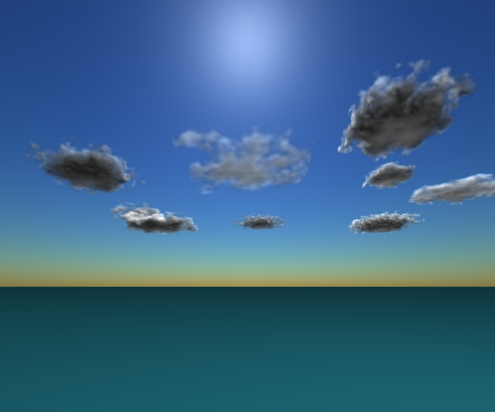
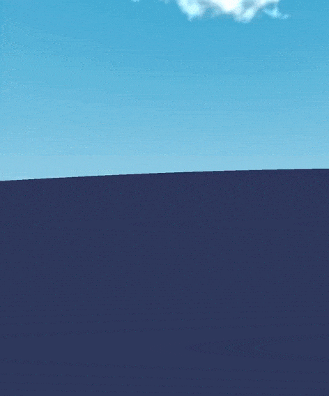
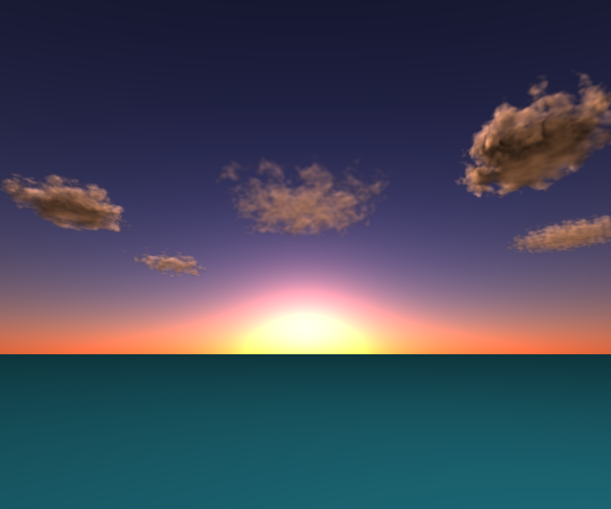

# projet-isim

## FEATURES

- Noises (Perlin noise and Worley noise) for generating cloud densities ✓ 

- Atmospheric Scattering (Rayleigh and Mie) ✓ 

- Create animation (camera translation and camera rotation) ✓

- Manage multiple cloud (cloud superposition) ✓

- HeightMap (cloud height) ✓

- Multiple light sources ✓

- Parallelization using goroutine ✓

- SIMD instruction

## Results

