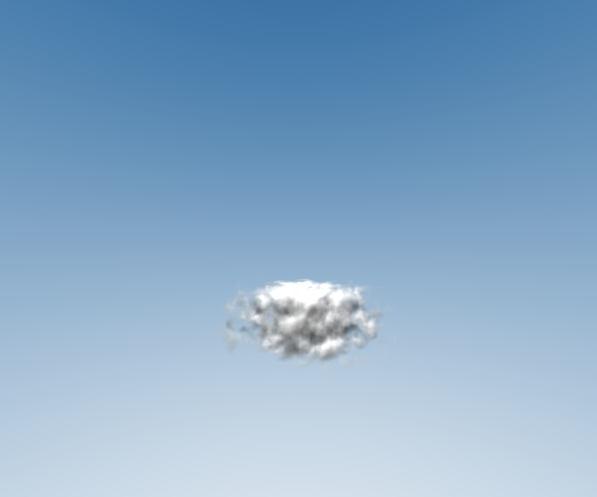
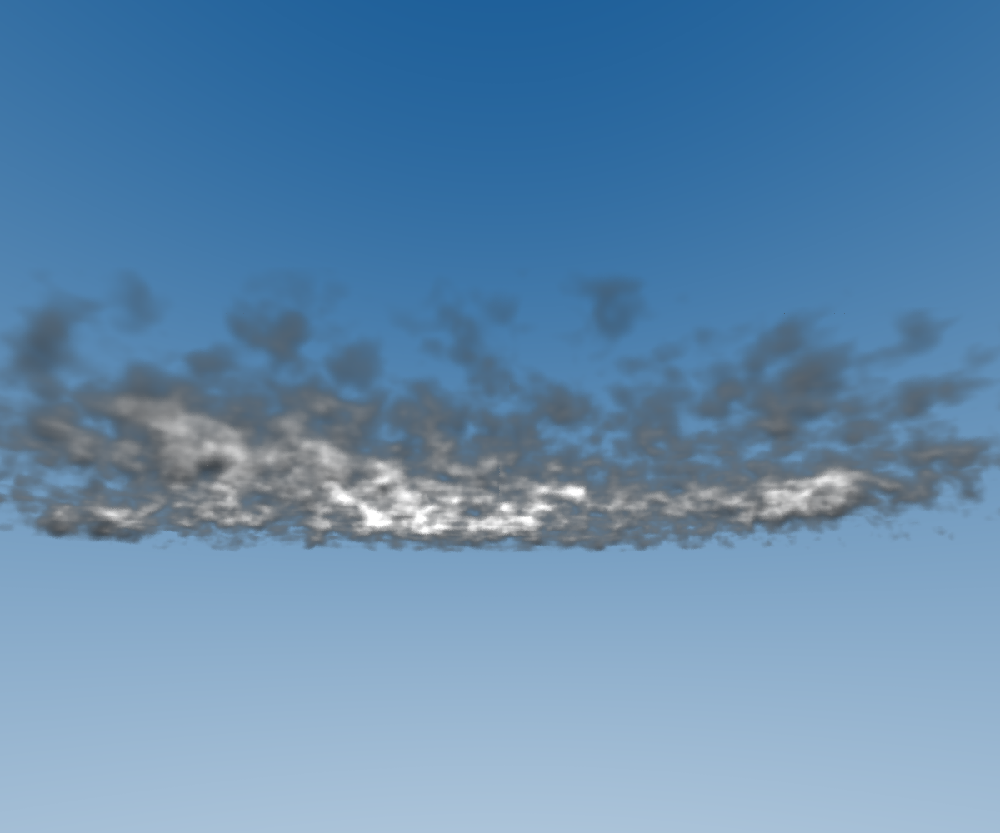

# projet-isim

## TODO

- SIMD instruction

- Add cool background sky / sun (sunset for example)

- Create animation (multiple images with camera rotation)

- Refacto code / all the param ✓

- Manage multiple cloud ✓

- Gaussian tower (maybe useless) ✓

- Add multiple light sources (or different types of light sources) ✓

- Add goroutine ✓

## Results

